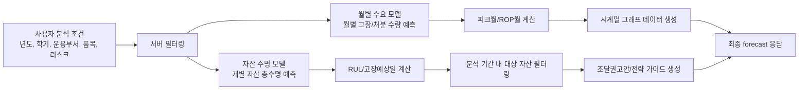

# 사용주기 AI 예측 산출물과 조달 권고안 생성 흐름

작성일: 2026-06-05

## 1. 문서 목적

이 문서는 현재 코드 기준으로 `자산 수명 모델`과 `월별 수요 모델`이 각각 어떤 산출물을 만들고, `app/ai_server.py`가 그 산출물을 어떻게 조달 계산 로직에 연결하는지 정리한 문서다.

확인한 핵심 파일은 다음과 같다.

- `app/ai_server.py`
- `ai_model/saved_models/current/model_meta.json`
- `ai_model/experiments/runs/20260525_003630_stage3_monthly_model_search/monthly_model_meta.json`
- `ai_model/experiments/scripts/run_stage2_life_model_search.py`
- `ai_model/experiments/scripts/run_stage3_monthly_model_search.py`
- `ai_model/experiments/scripts/modeling_common.py`

## 2. 전체 구조 요약

현재 사용주기 AI는 두 모델과 서버 계산 로직으로 나뉜다.



핵심은 두 모델의 역할이 다르다는 점이다.

| 구분 | 모델 산출물 | 서버에서 쓰는 방식 |
| --- | --- | --- |
| 자산 수명 모델 | 개별 자산별 `예측수명_월` | RUL과 `고장예상일` 계산 |
| 월별 수요 모델 | 월별 `고장/처분 예상 수량` | 그래프 수량, 피크월, ROP월 계산 |
| 서버 조달 계산 | 안전재고, 필요수량, 권장발주일, 예산, 코멘트 | 최종 UI 응답 생성 |

## 3. 자산 수명 모델 산출물

### 3.1. 모델 artifact

현재 서버가 읽는 자산 수명 모델은 다음 위치에 있다.

- 모델 파일: `ai_model/saved_models/current/model.pkl`
- 메타 파일: `ai_model/saved_models/current/model_meta.json`

현재 메타 정보 기준:

| 항목 | 값 |
| --- | --- |
| 모델 | CatBoost |
| variant | `cb_fast_shallow` |
| feature set | `importance_top_15` |
| target | `실제수명_개월` |
| target 의미 | 개별 자산의 총수명 개월 수 |
| Test RMSE | 13.2765개월 |
| Test MAE | 10.1507개월 |
| Test R2 | 0.9042 |
| 임박 자산 F1 | 0.8314 |

### 3.2. 모델 입력 feature

서버는 `model_meta.json`의 `features` 배열을 읽어 `model_features`에 저장한다. 현재 feature는 15개다.

1. `내용연수`
2. `부서가혹도`
3. `월평균사용시간`
4. `사용강도지수`
5. `누적점검수리횟수`
6. `누적수리횟수`
7. `최근2년수리횟수`
8. `마지막수리후경과개월`
9. `취득금액대비수리비율`
10. `최대장애심각도`
11. `부서예산등급_Code`
12. `부서교체성향`
13. `G2B목록명_Code`
14. `물품분류명_Code`
15. `운용부서코드_Code`

`build_model_input()`은 이 feature 순서에 맞춰 `target_df`를 재정렬한다. 누락 feature는 0으로 만들고, 결측값은 전체 데이터의 중앙값으로 채운다.

### 3.3. 서버에서 생성되는 자산 수명 모델 결과

`/api/ai/forecast` 안에서 자산 수명 모델은 다음 값을 만든다.

| 단계 | 코드상 컬럼/변수 | 의미 |
| --- | --- | --- |
| 모델 입력 | `input_data` | `model_features` 순서로 정렬된 입력 DataFrame |
| 모델 직접 출력 | `target_df['예측수명_월']` | 모델이 예측한 개별 자산 총수명 개월 |
| 운용 기간 | `age_months` | `운용연차 * 12` |
| 잔여수명 원값 | `RUL_개월_raw` | `예측수명_월 - age_months` |
| 잔여수명 보정값 | `RUL_개월` | 최소 0.5개월로 clip한 잔여수명 |
| 고장예상일 | `고장예상일` | `현재시각 + RUL_개월 * 30.4375일` |
| 기간 필터 결과 | `filtered_df` | 사용자가 선택한 학기 기간 안에 `고장예상일`이 들어오는 자산 |

중요한 점은 자산 수명 모델이 직접 `필요수량`, `안전재고`, `권장발주일`을 만들지 않는다는 것이다. 자산 수명 모델의 직접 산출물은 총수명 예측이고, 서버가 이를 RUL과 고장예상일로 변환한다.

## 4. 월별 수요 모델 산출물

### 4.1. 모델 artifact

월별 수요 모델은 최신 run 폴더에서 자동 탐색된다.

- 현재 모델 파일: `ai_model/experiments/runs/20260525_003630_stage3_monthly_model_search/monthly_demand_model.pkl`
- 현재 메타 파일: `ai_model/experiments/runs/20260525_003630_stage3_monthly_model_search/monthly_model_meta.json`

현재 메타 정보 기준:

| 항목 | 값 |
| --- | --- |
| 모델 | ExtraTrees |
| variant | `et_regularized` |
| feature set | `seasonal_7` |
| target | 월별 고장/처분 발생량 |
| Test RMSE | 9.7765건 |
| Test MAE | 5.3774건 |
| Test R2 | 0.9797 |

### 4.2. 모델 입력 feature

현재 월별 수요 모델 feature는 7개다.

1. `trend`
2. `month`
3. `month_sin`
4. `month_cos`
5. `lag_12`
6. `rolling_mean_6`
7. `rolling_std_6`

서버는 `monthly_model_meta.json`의 `features` 배열을 읽어 `monthly_demand_features`에 저장한다.

### 4.3. 서버에서 생성되는 월별 수요 모델 결과

`forecast_scope_monthly_demand()`가 월별 수요 모델 연결부다.

| 단계 | 코드상 변수 | 의미 |
| --- | --- | --- |
| 과거 월별 시계열 | `monthly` | 학습 가능 데이터의 불용일자/실제수명 기반 월별 고장/처분 수량 |
| lag feature | `history_feat` | lag, rolling, sin/cos feature가 붙은 월별 데이터 |
| 결측 대체값 | `fill_values` | 과거 feature 중앙값 |
| 예측 결과 map | `forecast_map` | `{월: 고장/처분 예상 수량}` |
| 피크월 | `peak_month` | `forecast_map`에서 수량이 가장 큰 월 |
| 대상 월 리스트 | `target_month_dates` | 선택 학기 기간의 월 시작일 리스트 |

이 함수는 월별 모델이 없거나 월별 과거 데이터가 부족하면 `(None, None, None)`을 반환한다.

주의할 점도 있다. 현재 코드에서는 요청 기간의 월이 이미 과거 월별 집계 `actual_lookup`에 있으면 모델 예측값이 아니라 실제 월별 수량을 `forecast_map`에 넣는다. 미래 월이면 모델 예측값을 넣는다.

## 5. 사용자 분석 조건 처리

`PredictionRequest`는 다음 구조다.

```json
{
  "prompt": "사용자 질의",
  "conditions": {
    "year": 2026,
    "semester": "1학기",
    "campus": "한양대학교 ERICA캠퍼스",
    "dept_name": "운용부서명",
    "category": "물품분류명",
    "risk_level": "Medium"
  }
}
```

현재 서버에서 필수로 검사하는 조건은 `year`, `semester`, `dept_name`이다.

현재 코드상 실제 필터링에 쓰이는 조건:

- `운용부서명 == dept_name`
- `물품분류명 == category`, 단 `category`가 있고 `"전체"`가 아닐 때만

현재 코드상 `campus`는 request schema에는 있지만 실제 `target_df` 필터링에는 사용되지 않는다.

## 6. 서버 조달 계산 로직

### 6.1. 리드타임 파생값

`get_lead_time_info(price)`는 `취득금액`을 기준으로 리드타임 관련 값을 만든다.

| 취득금액 조건 | `리드타임등급` | `등급점수` | `sqrt_L` | `리드타임_일` |
| --- | ---: | ---: | ---: | ---: |
| 2천만 원 이하 | 0 | 20.0 | 0.48 | 7 |
| 2천만 원 초과, 5천만 원 미만 | 1 | 60.0 | 0.81 | 20 |
| 5천만 원 이상 | 2 | 100.0 | 1.12 | 38 |

현재 코드에서는 `가격민감도`가 있으면 `장비중요도`도 다시 계산한다.

```text
장비중요도 = (가격민감도 * 100 * 0.5) + (등급점수 * 0.5)
```

다만 현재 배포된 CatBoost 모델 feature 15개에는 `장비중요도`, `가격민감도`, `리드타임등급`, `취득금액`이 포함되어 있지 않다. 따라서 이 파생값들은 현재 모델 입력에는 직접 쓰이지 않고, 조달 계산에 쓰일 수 있는 보조값으로 남아 있다.

### 6.2. 학기 기간 계산

서버는 사용자가 입력한 학기 조건을 날짜 범위로 바꾼다.

| semester 입력 | 시작일 | 종료일 |
| --- | --- | --- |
| `1`, `1학기` | `year-03-02` | `year-06-20` |
| `여름`, `여름방학`, `summer` | `year-06-21` | `year-08-31` |
| `2`, `2학기` | `year-09-01` | `year-12-20` |
| `겨울`, `겨울방학`, `winter` | `year-12-21` | `year+1-02-28` |
| 그 외 | `year-01-01` | `year-12-31` |

이 기간 안에 `고장예상일`이 들어오는 자산만 `filtered_df`가 된다.

### 6.3. 리스크 성향과 안전 버퍼

현재 코드의 리스크 계수는 다음과 같다.

| risk_level | z 값 | 의미 |
| --- | ---: | --- |
| Low | 0.0 | 안전재고 거의 없음 |
| Medium | 1.28 | 표준 수준 |
| High | 1.65 | 결품 리스크 회피 |

그리고 현재 코드에서는 다음 값을 계산한다.

```text
model_rmse = 5.0
buffer_days = ceil(z_val * model_rmse)
```

다만 현재 `buffer_days`는 계산만 되고 이후 조달권고안/발주일 계산에 실제로 사용되지 않는다.

### 6.4. 월별 수요와 ROP월

월별 수요 모델 결과가 있으면:

```text
monthly_counts_total = forecast_monthly_counts
peak_month = forecast_peak_month
```

그 다음 ROP월은 피크월의 한 달 전으로 계산한다.

```text
final_rop_month = target_months[max(0, peak_idx - 1)]
```

예를 들어 분석 기간이 3월~6월이고 피크월이 5월이면 ROP월은 4월이 된다.

### 6.5. 시계열 그래프 데이터

최종 응답의 `section_1_time_series`는 1월부터 12월까지 12개 row로 만들어진다.

기본 구조:

```json
{
  "month": 3,
  "quantity": 12,
  "is_rop": false
}
```

ROP월이면 추가 필드가 붙도록 되어 있다.

```json
{
  "month": 4,
  "quantity": 8,
  "is_rop": true,
  "rop_date": "2026-04-01",
  "base_qty": 0,
  "safety_stock": 0,
  "total_order_qty": 0
}
```

단, 현재 코드 기준으로 `base_qty`, `safety_stock`, `total_order_qty`는 모두 0으로 남는다. 이유는 아래의 “현재 코드상 문제점”에 정리했다.

## 7. 조달 권고안 최종 산출물

정상적으로 동작한다면 `/api/ai/forecast`의 최종 응답은 다음 최상위 구조를 가진다.

```json
{
  "forecastId": "pred-xxxxxxxx",
  "created_at": "2026-06-05T00:00:00",
  "prompt": "사용자 질의",
  "target": "운용부서명",
  "risk": "Medium",
  "period": "2026 - 1학기",
  "conditions": {
    "year": 2026,
    "semester": "1학기",
    "dept_name": "운용부서명",
    "category": "물품분류명",
    "risk_level": "Medium"
  },
  "section_1_time_series": [],
  "section_2_strategic_guide": {},
  "section_3_recommendations": [],
  "section_4_algorithm_guide": {}
}
```

각 섹션의 의미는 다음과 같다.

| 섹션 | 용도 | 현재 생성 방식 |
| --- | --- | --- |
| `section_1_time_series` | 월별 고장/처분 예상 수량 그래프, ROP 표시 | 월별 수요 모델 결과 기반 |
| `section_2_strategic_guide` | 총평, 수요 산출 근거, 발주 전략, 예산 가이드 | LLM + 서버 계산값 기반 |
| `section_3_recommendations` | 하단 조달권고안 표 | 현재 코드에서는 비어 있음 |
| `section_4_algorithm_guide` | 알고리즘 설명 문구 | 정적 문구 |

### 7.1. `section_2_strategic_guide`

정상 생성 시 다음 key를 가진다.

```json
{
  "ai_summary_comment": "LLM이 생성한 요약 코멘트",
  "smart_forecasting": "고장 예상 수량 + 안전재고 설명",
  "time_to_procure": "권장 발주마감일 설명",
  "budget_guide": "예산 확보 권고"
}
```

LLM 호출이 실패하면 fallback 문구가 들어간다.

### 7.2. `section_3_recommendations`

현재 서버 코드에서는 다음처럼 초기화만 되어 있다.

```python
recommendations = []
```

그 이후 `recommendations.append(...)`가 없다. 따라서 현재 코드 기준으로는 조달권고안 표에 들어갈 품목별 row가 생성되지 않는다.

또한 뒤쪽에서 `recommendations`를 집계할 때 최소한 다음 key가 있다고 가정한다.

- `quantity`
- `estimated_budget`

하지만 실제 row 생성부가 없기 때문에 현재는 항상 빈 리스트다.

업무 매뉴얼/화면 기획 기준으로는 이 섹션에 다음 값이 들어가는 것이 자연스럽다.

| 예상 필드 | 의미 |
| --- | --- |
| 순번 | 표 표시용 번호 |
| 품목명 | 물품분류명 또는 G2B목록명 |
| 수량 | 권장 발주 수량 |
| 추정예산 | 수량 * 기준 단가 또는 평균 취득금액 |
| 권장발주기한 | 리드타임과 버퍼를 역산한 날짜 |
| AI분석코멘트 | 해당 품목의 위험/수요 해석 |

하지만 이 구조는 현재 서버 코드에 아직 구현되어 있지 않다.

### 7.3. `section_4_algorithm_guide`

현재 정적 문구는 다음 3개다.

1. `적정 권장 수량 = 고장 예상 수량 + 안전 재고`
2. `발주 시점(ROP) = (월 별 평균 수요량 X 리드 타임) + 안전 재고`
3. `잔여 수명(RUL): 장비의 상태 기록과 부품별 내구연한을 딥러닝 모델로 분석하여 예측한 남은 가동 가능 시간`

참고로 실제 현재 모델은 딥러닝 모델이 아니라 CatBoost와 ExtraTrees다. 발표/문서 일관성을 위해 이 문구는 수정하는 것이 좋다.

## 8. 현재 코드상 중요한 문제점

현재 `app/ai_server.py`를 그대로 실행하면 조달권고안 생성 단계에서 정상 응답이 나오기 어렵다.

### 8.1. `earliest_order_date`가 정의되지 않음

아래 위치에서 `earliest_order_date`를 사용한다.

- ROP 시계열 row의 `rop_date`
- LLM 가이드 입력
- `time_to_procure` 문구

하지만 현재 파일 안에서 `earliest_order_date`를 만드는 코드가 없다.

따라서 대상 데이터가 있고 ROP월이 계산되는 일반 케이스에서는 `NameError`가 발생할 가능성이 높다.

### 8.2. `recommendations`가 생성되지 않음

`recommendations = []`만 있고 품목별 조달권고안을 append하는 코드가 없다.

그 결과:

- `section_3_recommendations`는 빈 배열이 된다.
- `total_qty_all = 0`
- `total_budget_all = 0`
- `smart_forecasting`에는 실제 권장 수량이 아니라 0개가 들어갈 수 있다.

### 8.3. 안전재고와 필요수량이 실제 계산되지 않음

`total_base_qty_all`, `total_safety_stock_all`이 0으로 초기화된 뒤 갱신되지 않는다.

따라서 현재 응답의 ROP row에 붙는 값은 다음처럼 0이 된다.

```json
{
  "base_qty": 0,
  "safety_stock": 0,
  "total_order_qty": 0
}
```

### 8.4. `buffer_days`가 계산만 되고 사용되지 않음

리스크 성향에 따라 `buffer_days`를 계산하지만 권장발주일 계산에 반영하지 않는다.

즉 현재 코드상 `High`를 선택해도 실제 발주일이 더 앞당겨지는 로직이 완성되어 있지 않다.

### 8.5. 월별 모델 fallback에서 `고장예상월` 컬럼이 없음

월별 수요 모델을 사용할 수 없을 때 다음 코드가 실행된다.

```python
monthly_counts_total = filtered_df.groupby('고장예상월').size().to_dict()
```

하지만 현재 `target_df['고장예상월'] = ...`를 만드는 코드가 없다. 월별 모델이 없거나 실패하면 이 fallback도 오류가 날 가능성이 있다.

### 8.6. campus 조건이 필터링에 쓰이지 않음

`PredictionConditions`에는 `campus`가 있지만 실제 필터링은 `운용부서명`, `물품분류명`만 사용한다.

ERICA/서울 데이터가 함께 들어 있는 경우 캠퍼스 필터가 기대와 다르게 동작할 수 있다.

## 9. 현재 코드 기준 산출물 흐름 정리

현재 구현 상태를 냉정하게 정리하면 다음과 같다.

| 항목 | 현재 상태 |
| --- | --- |
| 자산 수명 모델 로딩 | 정상 |
| 자산별 `예측수명_월` 생성 | 정상 |
| `RUL_개월`, `고장예상일` 생성 | 정상 |
| 월별 수요 모델 로딩 | 정상 |
| 월별 `forecast_map`, `peak_month` 생성 | 정상 가능 |
| ROP월 계산 | 정상 가능 |
| 시계열 데이터 생성 | `earliest_order_date` 때문에 오류 가능 |
| 품목별 조달권고안 생성 | 미구현 |
| 안전재고/필요수량 계산 | 미구현 또는 미연결 |
| 권장발주기한 계산 | 미구현 |
| 전략 가이드 생성 | `earliest_order_date`, 빈 recommendations 때문에 오류/부정확 가능 |

## 10. 권장 수정 방향

현재 모델 자체는 조달 계산에 필요한 기반값을 제공하고 있다. 문제는 모델 이후의 서버 조달 계산 연결부다.

우선순위는 다음과 같다.

1. `filtered_df['고장예상월'] = filtered_df['고장예상일'].dt.month` 추가
2. 품목별 그룹 단위로 `recommendations.append(...)` 구현
3. 품목별 `base_qty`, `safety_stock`, `quantity`, `estimated_budget`, `권장발주기한` 계산
4. `earliest_order_date`를 전체 권장발주기한 중 가장 이른 날짜로 정의
5. `total_base_qty_all`, `total_safety_stock_all`을 recommendations 집계값으로 갱신
6. `buffer_days`를 권장발주기한 계산에 반영
7. `campus` 조건을 실제 필터링에 반영
8. `section_4_algorithm_guide`의 딥러닝 표현을 현재 모델 구조에 맞게 수정

권장발주기한은 다음 형태로 계산하는 것이 현재 설계와 가장 잘 맞는다.

```text
권장발주기한 = 예상 고장/수요 피크 시작일 - 리드타임_일 - 리스크 버퍼일
```

품목별 권장 수량은 다음 형태가 자연스럽다.

```text
고장예상수량 = 분석 기간 내 해당 품목의 고장예상일 진입 자산 수
안전재고 = ceil(고장예상수량 * 리스크별 안전재고율 또는 z * 수요표준편차 * sqrt_L)
필요수량 = 고장예상수량 + 안전재고
추정예산 = 필요수량 * 해당 품목 평균 취득금액
```

## 11. 발표/보고서용 한 줄 해석

현재 모델링 구조는 타당하다. 자산 수명 모델은 개별 자산의 교체 시점을 만들고, 월별 수요 모델은 수요가 몰리는 월을 잡아낸다. 다만 현재 서버의 조달권고안 생성 로직은 모델 산출물을 최종 발주 수량/발주기한으로 연결하는 부분이 아직 완성되지 않았으므로, 이 연결부를 보완해야 UI의 조달권고안이 설계 의도대로 동작한다.
