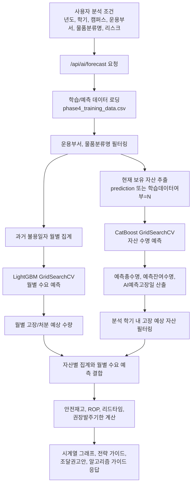

# 사용주기 AI 예측 산출물과 조달 권고안 생성 흐름

작성일: 2026-06-05  
기준 코드: `app/ai_server.py` main pull 이후 버전

## 1. 문서 목적

이 문서는 현재 서버 기준으로 사용주기 AI 예측 기능이 어떤 입력을 받고, 자산 수명 예측 모델과 월별 수요 예측 모델의 산출물을 어떻게 조합해 최종 조달 권고안을 만드는지 정리한 문서이다.

현재 채택 기준은 다음과 같다.

| 구분 | 채택 모델 | 서버에서의 역할 |
| --- | --- | --- |
| 자산 수명 예측 모델 | CatBoost + GridSearchCV | 개별 자산의 예측 총수명과 잔여수명, AI예측고장일 계산 |
| 월별 수요 예측 모델 | LightGBM + GridSearchCV | 분석 기간의 월별 고장/처분 수요량 보정 |
| 서버 조달 계산 로직 | FastAPI 내부 계산식 | 안전재고, ROP, 권장발주기한, 추정예산, 조달권고안 생성 |

중요한 점은 모델이 직접 권장발주일이나 예산을 예측하는 구조가 아니라는 것이다. 두 모델은 각각 수명과 수요를 예측하고, 서버가 그 예측값을 SCM 계산식에 넣어 최종 조달 결과를 만든다.

## 2. 전체 흐름 요약



## 3. 서버 배포 파일 기준

현재 `app/ai_server.py`는 모델과 데이터를 `app/` 폴더 기준으로 직접 로드한다.

| 용도 | 서버가 읽는 경로 | 설명 |
| --- | --- | --- |
| 자산 수명 모델 | `app/asset_life_model.pkl` | CatBoost + GridSearchCV 모델 또는 best estimator |
| 월별 수요 모델 | `app/monthly_demand_model.pkl` | LightGBM + GridSearchCV 모델 또는 best estimator |
| 예측용 데이터 | `app/phase4_training_data.csv` | phase4에서 생성한 학습/예측 통합 데이터 |

실험 산출물 보관 경로는 별도로 존재한다.

| 용도 | 실험/보관 경로 |
| --- | --- |
| 자산 수명 모델 보관본 | `ai_model/saved_models/current/model.pkl` |
| 자산 수명 모델 메타 | `ai_model/saved_models/current/model_meta.json` |
| 월별 수요 모델 보관본 | `ai_model/saved_models/monthly_demand/current/monthly_demand_model.pkl` |
| 월별 수요 모델 메타 | `ai_model/saved_models/monthly_demand/current/monthly_model_meta.json` |

주의할 점은 서버가 `ai_model/saved_models/...` 경로를 직접 읽지 않는다는 것이다. 실제 FastAPI 서버 실행 시에는 채택한 모델과 CSV를 `app/asset_life_model.pkl`, `app/monthly_demand_model.pkl`, `app/phase4_training_data.csv` 이름으로 배치해야 한다.

또한 서버는 `joblib.load()` 후 `best_estimator_` 속성이 있으면 이를 자동으로 꺼내 사용한다. 따라서 GridSearchCV 객체를 그대로 저장해도 되고, 최종 best estimator만 저장해도 서버 입력 흐름은 유지된다.

```python
def unwrap_model(model):
    return getattr(model, "best_estimator_", model)
```

## 4. API 입력 조건

사용주기 AI 예측은 `POST /api/ai/forecast`로 실행된다.

요청 구조는 다음과 같다.

```json
{
  "prompt": "이번 학기 컴퓨터공학과 실습실 장비 얼마나 교체해야 해?",
  "conditions": {
    "year": 2026,
    "semester": "1학기",
    "campus": "한양대학교 ERICA캠퍼스",
    "dept_name": "소프트웨어융합대학",
    "category": "노트북컴퓨터",
    "risk_level": "Medium"
  }
}
```

현재 서버에서 필수로 검사하는 값은 `year`, `semester`, `dept_name`이다.

| 입력값 | 현재 서버 사용 여부 | 사용 방식 |
| --- | --- | --- |
| `year` | 사용 | 분석 기간 산출 |
| `semester` | 사용 | 학기별 시작일/종료일 산출 |
| `campus` | 스키마에는 있으나 필터에는 미사용 | 기본값은 ERICA캠퍼스 |
| `dept_name` | 사용 | `운용부서명` 기준 필터링 |
| `category` | 사용 | `물품분류명` 기준 필터링, `전체`면 미적용 |
| `risk_level` | 사용 | 안전재고 Z값과 발주 버퍼 일수 결정 |

현재 코드에서는 `campus`가 요청 스키마에 있지만 실제 데이터 필터링과 최종 `conditions` 응답에는 반영되지 않는다. 캠퍼스별 데이터가 섞일 가능성이 있다면 추후 `캠퍼스 == cond.campus` 필터를 추가하는 것이 좋다.

## 5. 분석 기간 계산

서버는 `year`, `semester`를 날짜 범위로 바꾼다.

| 학기 입력 | 시작일 | 종료일 |
| --- | --- | --- |
| `1`, `1학기` | `year-03-02` | `year-06-20` |
| `여름`, `여름방학`, `summer` | `year-06-21` | `year-08-31` |
| `2`, `2학기` | `year-09-01` | `year-12-20` |
| `겨울`, `겨울방학`, `winter` | `year-12-21` | `year+1-02-28` |
| 그 외 | `year-01-01` | `year-12-31` |

이 기간에 해당하는 월 목록이 `target_periods`가 되며, 이후 월별 수요량과 ROP 그래프는 이 월 목록을 기준으로 계산된다.

## 6. 데이터 필터링과 전처리

서버는 `app/phase4_training_data.csv`를 읽고, 일부 코드형 컬럼이 없으면 서버 시작 시 category code를 생성한다.

자동 생성 대상은 다음과 같다.

| 원본 컬럼 | 생성 컬럼 |
| --- | --- |
| `G2B목록명` | `G2B목록명_Code` |
| `물품분류명` | `물품분류명_Code` |
| `운용부서코드` | `운용부서코드_Code` |
| `캠퍼스` | `캠퍼스_Code` |
| `부서예산등급` | `부서예산등급_Code` |

분석 요청이 들어오면 먼저 전체 데이터에서 다음 조건을 적용한다.

1. `운용부서명 == cond.dept_name`
2. `category`가 있고 `전체`가 아니면 `물품분류명 == cond.category`

이렇게 만들어진 `source_df`는 두 모델에서 다르게 사용된다.

| 데이터프레임 | 용도 | 생성 방식 |
| --- | --- | --- |
| `source_df` | 월별 수요 모델의 과거 이력 생성 | 부서/품목 필터 후 전체 이력 사용 |
| `target_df` | 자산 수명 모델의 현재 보유 자산 예측 | `source_df`에서 현재 보유/예측 대상 자산만 추출 |
| `filtered_df` | 분석 기간 내 고장 예상 자산 | `target_df` 중 `AI예측고장일`이 분석 기간에 포함되는 행 |

현재 보유 자산 추출은 다음 우선순위로 처리된다.

1. `데이터세트구분 == "prediction"` 행이 있으면 해당 행 사용
2. 없으면 `학습데이터여부 == "N"` 행이 있으면 해당 행 사용
3. 둘 다 없으면 필터링된 전체 데이터 사용

## 7. 자산 수명 예측 모델 흐름

### 7.1. 모델 입력

자산 수명 모델은 CatBoost + GridSearchCV로 채택했다. 서버는 모델 객체에서 feature 이름을 먼저 확인하고, 없으면 fallback feature 목록을 사용한다.

현재 fallback feature는 다음 15개이다.

| 번호 | feature |
| ---: | --- |
| 1 | `내용연수` |
| 2 | `부서가혹도` |
| 3 | `월평균사용시간` |
| 4 | `사용강도지수` |
| 5 | `누적점검수리횟수` |
| 6 | `누적수리횟수` |
| 7 | `최근2년수리횟수` |
| 8 | `마지막수리후경과개월` |
| 9 | `취득금액대비수리비율` |
| 10 | `최대장애심각도` |
| 11 | `부서예산등급_Code` |
| 12 | `부서교체성향` |
| 13 | `G2B목록명_Code` |
| 14 | `물품분류명_Code` |
| 15 | `운용부서코드_Code` |

모델 입력값은 숫자형으로 변환되며, 변환되지 않는 값이나 결측값은 0으로 채워진다.

### 7.2. 모델 직접 산출물

자산 수명 모델의 직접 산출물은 개별 자산의 총수명 예측값이다.

```text
예측총수명_개월 = CatBoost 모델 예측값
```

서버는 이 값을 최소 1개월 이상으로 보정한다.

### 7.3. 서버에서 추가 계산하는 값

자산 수명 모델 예측 이후 서버가 계산하는 값은 다음과 같다.

| 산출 컬럼 | 계산 방식 | 의미 |
| --- | --- | --- |
| `예측총수명_개월` | CatBoost 예측값 | 해당 자산의 예상 총 사용 가능 기간 |
| `운용개월` | `운용연차 * 12` 또는 `현재일 - 취득일자` | 현재까지 사용한 기간 |
| `예측잔여수명` | `예측총수명_개월 - 운용개월` | 앞으로 남은 사용 가능 기간 |
| `AI예측고장일` | `현재일 + 예측잔여수명 * 30.4일` | 고장 또는 교체 필요 시점 |
| `고장예상월기간` | `AI예측고장일`의 연월 | 월별 집계 기준 |

즉 자산 수명 모델은 `권장발주기한`을 직접 예측하지 않는다. 모델은 개별 자산이 언제쯤 수명이 다할지 계산하는 기반값을 만들고, 서버가 이를 조달 계산식에 연결한다.

## 8. 월별 수요 예측 모델 흐름

### 8.1. 모델 입력

월별 수요 모델은 LightGBM + GridSearchCV로 채택했다. 현재 fallback feature는 다음 7개이다.

| 번호 | feature | 의미 |
| ---: | --- | --- |
| 1 | `trend` | 전체 월 흐름 순번 |
| 2 | `month` | 월 |
| 3 | `month_sin` | 월 계절성 sin 인코딩 |
| 4 | `month_cos` | 월 계절성 cos 인코딩 |
| 5 | `lag_12` | 12개월 전 수요량 |
| 6 | `rolling_mean_6` | 최근 6개월 평균 수요량 |
| 7 | `rolling_std_6` | 최근 6개월 수요 표준편차 |

### 8.2. 과거 이력 생성

월별 수요 모델의 과거 이력은 `source_df`의 `불용일자`를 기준으로 만든다.

1. `불용일자`가 없으면 빈 이력으로 처리
2. `학습데이터여부` 컬럼이 있으면 `Y`인 행만 과거 실제 이력으로 사용
3. `불용일자`를 월 단위로 변환
4. 월별 건수를 집계해 과거 월별 수요량 시계열 생성

```text
월별 과거 수요량 = 학습 데이터의 불용일자 월별 count
```

### 8.3. 재귀 예측 방식

서버는 과거 월별 이력의 마지막 월 다음 달부터 분석 종료 월까지 한 달씩 예측한다.

각 예측 월마다 다음 값을 만든다.

```text
trend
month
month_sin
month_cos
lag_12
rolling_mean_6
rolling_std_6
```

그리고 LightGBM 모델로 해당 월의 예상 고장/처분 수량을 예측한다.

```text
월별 수요 예측값 = LightGBM 모델 예측값
```

예측값은 반올림 후 0 이상 정수로 보정된다.

```text
predicted_qty = max(0, round(LightGBM 예측값))
```

이 방식은 recursive forecast이다. 즉 미래 월의 lag/rolling feature를 만들 때 실제 미래 값을 쓰지 않고, 앞에서 예측한 값을 다음 월 feature에 다시 사용한다. 따라서 시간 기반 예측에서 미래 정답 누수를 줄이는 구조이다.

## 9. 두 모델 산출물 결합 방식

서버는 분석 기간의 각 월마다 두 값을 만든다.

| 값 | 출처 | 의미 |
| --- | --- | --- |
| `asset_qty` | CatBoost 자산 수명 모델 결과 집계 | 해당 월에 개별 자산 기준으로 고장 예상되는 수량 |
| `demand_qty` | LightGBM 월별 수요 모델 결과 | 해당 월의 전체 고장/처분 수요 예측 수량 |

최종 월별 고장예상수량은 둘 중 큰 값으로 선택한다.

```text
월별 고장예상수량 = max(자산별 AI예측고장월 집계, LightGBM 월별 수요 예측)
```

이 결합 방식의 의도는 다음과 같다.

1. CatBoost는 개별 자산 단위의 교체 시점 설명력이 좋다.
2. LightGBM은 월별 총량과 계절성, lag 흐름을 보정하는 데 좋다.
3. 둘 중 더 큰 값을 사용하면 개별 자산 모델이 수요를 과소 추정하는 경우를 완화할 수 있다.
4. 조달 계획에서는 부족 발주가 더 위험하므로 보수적인 수량 산출이 가능하다.

다만 이 방식은 두 모델의 예측값을 평균내는 앙상블이 아니라, 조달 실무 관점에서 수요 부족을 피하기 위한 보정 규칙이다.

## 10. 리드타임 계산

서버는 `취득금액`을 기준으로 리드타임 관련 값을 만든다.

| 취득금액 조건 | `리드타임등급` | `등급점수` | `sqrt_L` | `리드타임_일` |
| --- | ---: | ---: | ---: | ---: |
| 2천만 원 이하 | 0 | 20.0 | 0.48 | 7 |
| 2천만 원 초과, 5천만 원 미만 | 1 | 60.0 | 0.81 | 20 |
| 5천만 원 이상 | 2 | 100.0 | 1.12 | 38 |

`취득금액` 컬럼이 없으면 기본값으로 `리드타임_일 = 7`, `sqrt_L = 0.48`을 사용한다.

## 11. 리스크 성향 반영

리스크 성향은 안전재고와 권장발주기한에 영향을 준다.

| `risk_level` | Z값 | 발주 버퍼 | 의미 |
| --- | ---: | ---: | --- |
| `Low` | 0.0 | 0일 | 안전재고를 거의 두지 않음 |
| `Medium` | 1.28 | 14일 | 표준 수준의 안전재고와 발주 여유 |
| `High` | 1.65 | 30일 | 결품 위험을 줄이기 위해 더 많은 안전재고와 이른 발주 |

안전재고 계산식은 다음과 같다.

```text
안전재고 = ceil(Z값 * 월별 수요 표준편차 * sqrt(리드타임))
```

발주일 계산에서는 리스크 버퍼가 클수록 권장발주기한이 더 앞당겨진다.

```text
권장발주기한 = 예측 고장 기준일 - 리드타임 - 리스크 버퍼
```

현재 서버는 계산된 권장발주기한이 이미 지난 날짜라면 `현재일`로 보정한다.

```text
최종 권장발주기한 = max(계산된 권장발주기한, 현재일)
```

따라서 UI에서는 이미 늦은 발주 건도 과거 날짜가 아니라 오늘 날짜로 표시될 수 있다.

## 12. 조달권고안 계산 방식

### 12.1. 분석 기간 내 고장 예상 자산이 있는 경우

`filtered_df`가 비어 있지 않으면, 즉 분석 기간 내 `AI예측고장일`이 들어오는 개별 자산이 있으면 서버는 `G2B목록명` 단위로 조달권고안을 만든다.

품목별 계산 순서는 다음과 같다.

1. 품목별 월별 고장 예상 수량을 집계한다.
2. LightGBM 월별 수요 예측 총량이 CatBoost 자산 집계 총량보다 크면 `demand_scale`로 품목별 수량을 보정한다.
3. 월평균 수요량을 계산한다.
4. 평균 리드타임과 `sqrt_L`을 계산한다.
5. 월별 수요 표준편차를 계산한다.
6. 안전재고를 계산한다.
7. ROP를 계산한다.
8. 누적 수요량이 ROP 이상이 되는 월을 ROP 트리거 월로 잡는다.
9. 기본 고장 예상 수량과 안전재고를 더해 최종 필요수량을 만든다.
10. 평균 취득금액을 단가로 사용해 추정예산을 계산한다.
11. 평균 AI예측고장일에서 리드타임과 리스크 버퍼를 빼 권장발주기한을 계산한다.

핵심 계산식은 다음과 같다.

```text
demand_scale = max(1.0, LightGBM 기간 총수요 / CatBoost 기간 총수요)
품목별 보정 월수요 = ceil(품목별 자산 고장 수량 * demand_scale)
월평균수요 = 분석 기간 월수요 합계 / 분석 월 수
ROP = ceil(월평균수요 * 리드타임개월 + 안전재고)
기본수량 = max(1, ceil(품목별 고장예상 자산 수 * demand_scale))
최종 필요수량 = 기본수량 + 안전재고
추정예산 = 최종 필요수량 * 평균 취득금액
권장발주기한 = 평균 AI예측고장일 - 평균 리드타임일 - 리스크 버퍼일
```

### 12.2. 분석 기간 내 개별 고장 예상 자산이 없는 경우

`filtered_df`가 비어 있으면 개별 자산 기준으로는 해당 기간에 고장 예정 자산이 없다는 뜻이다.

하지만 LightGBM 월별 수요 모델이 기간 내 수요를 예측할 수 있으므로, 서버는 월별 수요 예측값을 기반으로 fallback 조달권고안을 만든다.

이때 품목명은 다음 중 하나가 된다.

1. 사용자가 특정 `category`를 선택했으면 해당 품목분류명
2. `전체`이거나 미입력이면 `전체 품목`

계산 방식은 다음과 같다.

```text
기본수량 = 분석 기간 LightGBM 월별 수요 합계
안전재고 = ceil(Z값 * 월별 수요 표준편차 * sqrt(리드타임))
최종 필요수량 = 기본수량 + 안전재고
ROP = ceil(월평균수요 * 리드타임개월 + 안전재고)
권장발주기한 = 피크 수요월 시작일 - 평균 리드타임일 - 리스크 버퍼일
```

LightGBM도 수요를 0으로 예측하면 `quantity`, `estimated_budget`, `rop`가 0인 권고안 row가 생성된다.

## 13. 최종 API 응답 구조

정상 실행 시 `/api/ai/forecast`는 다음 구조를 반환한다.

```json
{
  "forecastId": "pred-xxxxxxxx",
  "created_at": "2026-06-05T22:00:00",
  "prompt": "이번 학기 실습실 장비 교체 수요 알려줘",
  "target": "소프트웨어융합대학",
  "risk": "Medium",
  "period": "2026 - 1학기",
  "conditions": {
    "year": 2026,
    "semester": "1학기",
    "dept_name": "소프트웨어융합대학",
    "category": "노트북컴퓨터",
    "risk_level": "Medium"
  },
  "section_1_time_series": [],
  "section_2_strategic_guide": {},
  "section_3_recommendations": [],
  "section_4_algorithm_guide": {}
}
```

### 13.1. `section_1_time_series`

월별 고장예상수량 그래프용 데이터이다. 1월부터 12월까지 12개 row가 생성되며, 분석 대상 학기에 해당하는 월만 수량이 들어간다.

기본 구조는 다음과 같다.

```json
{
  "month": 3,
  "quantity": 18,
  "is_rop": false
}
```

ROP 월에는 추가 값이 붙는다.

```json
{
  "month": 4,
  "quantity": 25,
  "is_rop": true,
  "rop_date": "2026-04-10",
  "base_qty": 30,
  "safety_stock": 5,
  "total_order_qty": 35
}
```

여기서 `quantity`는 최종 월별 고장예상수량이다. 즉 CatBoost 자산별 집계와 LightGBM 월별 수요 예측 중 큰 값을 사용한 결과이다.

### 13.2. `section_2_strategic_guide`

좌측 전략 가이드 패널용 데이터이다.

```json
{
  "ai_summary_comment": "수요 분석 결과, 5월 전후로 노후 장비 처분이 예측됩니다.",
  "smart_forecasting": "CatBoost 자산 수명 모델로 예측잔여수명을 계산하고, LightGBM 월별 수요 모델로 월별 고장예상수량을 보정했습니다...",
  "time_to_procure": "ROP와 리드타임, 리스크 버퍼를 역산한 결과입니다...",
  "budget_guide": "해당 수량 조달 및 설치를 위해 약 00,000천 원의 예산 확보를 권고합니다."
}
```

`ai_summary_comment`는 OpenAI API를 통해 생성한다. API 키가 없거나 호출에 실패하면 서버의 fallback 문구를 사용한다.

### 13.3. `section_3_recommendations`

하단 조달권고안 테이블용 데이터이다.

품목별 row 구조는 다음과 같다.

```json
{
  "id": 1,
  "item_name": "노트북컴퓨터",
  "quantity": 35,
  "unit_price": 1200000,
  "estimated_budget": 42000000,
  "recommend_order_date": "2026-04-10",
  "base_qty": 30,
  "safety_stock": 5,
  "rop": 12,
  "lead_time_days": 20.0,
  "monthly_avg_demand": 8.75
}
```

각 필드의 의미는 다음과 같다.

| 필드 | 의미 |
| --- | --- |
| `id` | 조달권고안 row 번호 |
| `item_name` | `G2B목록명` 또는 fallback 품목명 |
| `quantity` | 최종 필요수량, `base_qty + safety_stock` |
| `unit_price` | 해당 품목 평균 취득금액 |
| `estimated_budget` | `quantity * unit_price` |
| `recommend_order_date` | 리드타임과 리스크 버퍼를 역산한 권장발주기한 |
| `base_qty` | 분석 기간의 기본 고장/수요 예상 수량 |
| `safety_stock` | 리스크 성향을 반영한 안전재고 |
| `rop` | 재발주점 수량 |
| `lead_time_days` | 평균 조달 리드타임 |
| `monthly_avg_demand` | 분석 기간 월평균 수요량 |

### 13.4. `section_4_algorithm_guide`

UI에서 알고리즘 설명을 보여주기 위한 고정 문구이다.

현재 서버 문구는 다음 계산식을 사용한다.

```text
예측잔여수명 = CatBoost 예측총수명(개월) - 현재 운용개월
AI예측고장일 = 현재일 + 예측잔여수명 X 30.4일
월별 고장예상수량 = max(자산별 AI예측고장월 집계, LightGBM 월별 수요 예측)
안전재고 = Z값(리스크 수준) X 월별 수요 표준편차 X sqrt(리드타임)
ROP = 월평균 수요 X 리드타임 + 안전재고
권장발주기한 = AI예측고장일 - 리드타임 - 리스크 버퍼
```

## 14. UI에 표시되는 핵심 값의 출처

| UI 표시값 | 모델 직접 산출 여부 | 실제 계산 출처 |
| --- | --- | --- |
| `고장 예상 수량` | 일부 모델 산출 | CatBoost 월별 집계와 LightGBM 월별 예측 중 큰 값 |
| `필요 수량` | 모델 직접 산출 아님 | 서버에서 `기본수량 + 안전재고`로 계산 |
| `안전재고` | 모델 직접 산출 아님 | 리스크 Z값, 월별 수요 표준편차, 리드타임으로 계산 |
| `발주시점(ROP)` | 모델 직접 산출 아님 | 월평균 수요, 리드타임, 안전재고로 계산 |
| `권장발주기한` | 모델 직접 산출 아님 | 예측 고장일 또는 피크 수요월에서 리드타임과 리스크 버퍼를 차감 |
| `추정예산` | 모델 직접 산출 아님 | 필요수량과 평균 취득금액으로 계산 |
| `AI분석코멘트` | LLM 생성 | 서버 계산값을 요약해 OpenAI API 또는 fallback 문구로 생성 |

따라서 모델 성능 지표인 RMSE, MAE, R2는 서버 응답에 직접 들어가는 값이 아니다. 이 지표들은 모델 선택과 신뢰도 설명을 위한 평가 지표이고, UI에 뜨는 수량과 날짜는 모델 예측값을 서버 조달 계산식에 넣어 만든 업무 산출물이다.

## 15. 예측 기록 저장 흐름

분석 결과가 생성되면 서버는 `forecastId`를 만들고 인메모리 딕셔너리인 `predictions_db`에 저장한다.

| API | 역할 |
| --- | --- |
| `GET /api/ai/forecast` | 이전 분석 결과 목록 조회 |
| `GET /api/ai/forecast/contents/{forecastId}` | 특정 분석 결과 상세 조회 |
| `DELETE /api/ai/forecast?forecastId=...` | 특정 분석 결과 삭제 |
| `PUT /api/ai/forecast/{forecastId}` | 분석 결과 제목 수정 |

현재 저장소는 인메모리 DB이므로 서버를 재시작하면 이전 분석 결과는 사라진다. 영구 보관이 필요하면 DB 연동이 필요하다.

## 16. 현재 코드 기준 체크포인트

1. 서버 실행 전 `app/asset_life_model.pkl`, `app/monthly_demand_model.pkl`, `app/phase4_training_data.csv`가 반드시 있어야 한다.
2. GridSearchCV 객체를 저장해도 서버가 `best_estimator_`를 자동으로 꺼내 쓰므로 모델 교체 시 서버 코드를 크게 바꿀 필요가 없다.
3. `campus`는 현재 요청 스키마에만 있고 실제 필터링에는 사용되지 않는다.
4. 권장발주기한이 이미 지난 날짜이면 서버가 오늘 날짜로 보정한다.
5. 분석 대상 데이터가 없으면 정상 응답이지만 `status`, `data`로 감싼 빈 결과 구조가 반환된다. 일반 성공 응답과 shape가 다르므로 프론트에서 방어가 필요하다.
6. OpenAI API 키가 없어도 조달 계산 자체는 가능하지만, 전략 가이드의 요약 코멘트는 fallback 문구로 대체된다.
7. 월별 수요 예측은 미래 실제값을 쓰지 않는 recursive forecast 방식이라 시간 누수 방지 측면에서 설명하기 좋다.

## 17. 발표용 해석 문장

현재 구조는 하나의 모델이 모든 것을 예측하는 방식이 아니라, 문제를 두 개로 분리한 구조이다. CatBoost 자산 수명 모델은 개별 장비의 교체 시점을 예측하고, LightGBM 월별 수요 모델은 학기별 수요 총량과 월별 집중 흐름을 보정한다. 이후 서버는 두 모델의 산출물을 조달 리드타임, 안전재고, ROP 계산식에 연결해 실제 업무자가 바로 볼 수 있는 권장발주기한, 필요수량, 예산 규모를 산출한다.

이 방식은 졸업캡스톤 발표에서 다음처럼 설명할 수 있다.

```text
개별 자산의 노후화 예측과 월별 조달 수요 예측은 목적이 다르기 때문에 모델을 분리했습니다.
CatBoost는 자산별 잔여수명과 고장예상일을 계산하고, LightGBM은 월별 수요 총량을 보정합니다.
서버는 두 예측값을 결합해 안전재고, ROP, 리드타임을 반영한 조달권고안을 생성합니다.
따라서 최종 산출물은 단순 고장 예측이 아니라, 실제 발주 계획에 바로 사용할 수 있는 수량, 예산, 권장발주기한입니다.
```
