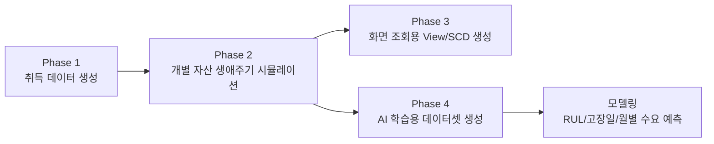

# 데이터 생성 Phase 1~4 원리 정리

이 문서는 `dataset/create_data` 폴더의 데이터 생성 스크립트가 어떤 원리로 대학 물품관리 데이터를 만드는지 정리한 설명서입니다.  
직접 생성한 합성 데이터이지만, 단순 난수 데이터가 아니라 대학 물품관리 업무 흐름인 `취득 -> 운용 -> 반납/불용 -> 처분 -> 조회/AI 학습` 구조를 따라가도록 설계되어 있습니다.

## 0. 전체 설계 방향

### 0.1. 왜 합성 데이터를 만들었는가

이 프로젝트의 목표는 대학 물품관리 시스템에서 물품의 취득, 운용, 불용, 처분 이력과 AI 기반 사용주기 예측을 구현하는 것입니다.  
하지만 실제 대학의 물품 생애주기 데이터는 개인정보, 내부 자산 정보, 회계/조달 기록이 포함될 수 있어 공개 데이터로 확보하기 어렵습니다.

따라서 현재 데이터는 외부 공개 데이터셋을 그대로 가져온 것이 아니라, 다음 기준으로 직접 생성한 합성 데이터입니다.

- 대학 물품관리 업무 메뉴 구조와 동일한 흐름을 갖는다.
- 조달청 G2B 물품 목록처럼 표준 물품명, 분류, 내용연수, 취득금액을 가진다.
- 물품별 기대수명, 부서별 사용 강도, 가격대, 관리 상태에 따라 수명이 달라진다.
- 실제 행정 업무처럼 승인 상태, 대기/반려, 반납, 불용, 처분, 이력 로그가 생성된다.
- AI 학습 단계에서는 물리적 고장/노후화 데이터와 행정적 반납 데이터를 구분한다.

### 0.2. 재현성 확보

Phase 1~4는 모두 같은 기준일과 난수 시드를 사용합니다.

- 기준일: `2026-02-10`
- 난수 시드: `42`
- 출력 인코딩: `utf-8-sig`

기준일을 실제 실행 날짜가 아니라 고정 날짜로 둔 이유는, 실행할 때마다 자산 나이와 잔여수명이 달라지는 문제를 막기 위해서입니다.  
즉 같은 코드와 같은 입력으로 실행하면 거의 같은 데이터가 재생성되도록 만든 것입니다.

### 0.3. 전체 흐름



현재 생성된 주요 데이터 규모는 다음과 같습니다.

| 구분 | 현재 생성 결과 |
| --- | ---: |
| Phase 1 취득 대장 | 4,184건 |
| Phase 2 개별 자산 | 16,422건 |
| 최종 상태: 운용 | 8,431건 |
| 최종 상태: 처분 | 7,412건 |
| 최종 상태: 불용 | 527건 |
| 최종 상태: 반납 | 52건 |
| Phase 4 최종 ML 데이터 | 16,321건 |
| 학습 데이터 Y | 7,201건 |
| 예측 대상 N | 9,120건 |
| Train / Valid / Test | 5,034 / 1,435 / 732건 |

## 1. Phase 1: 취득 데이터 생성

### 1.1. 담당 파일

- `dataset/create_data/phase1_acquisition.py`

### 1.2. 목적

Phase 1은 대학이 물품을 취득하는 단계의 원천 데이터를 만듭니다.  
물품을 언제, 어느 부서가, 어떤 품목을, 몇 개, 얼마에 취득했는지를 생성합니다.

이 단계의 결과는 실제 시스템의 `물품 취득 대장`, `G2B 물품 목록 조회`와 같은 화면에서 사용할 수 있는 기반 데이터입니다.

### 1.3. 주요 출력 파일

저장 위치: `dataset/create_data/data_lifecycle`

| 파일 | 의미 |
| --- | --- |
| `03_01_acquisition_master.csv` | 물품 취득 대장 |
| `03_02_g2b_class_list.csv` | G2B 물품분류 목록 |
| `03_02_g2b_item_list.csv` | G2B 물품식별 목록 |

### 1.4. 기본 마스터 데이터

Phase 1은 다음 마스터 데이터를 기반으로 시작합니다.

- G2B 품목 마스터
- 부서 마스터
- 품목별 비고 문구 템플릿
- 특수 물품 마스터

G2B 품목에는 노트북컴퓨터, 데스크톱컴퓨터, 액정모니터, 레이저프린터, 네트워크라우터, 책상, 의자, 칠판보조장, 인터랙티브화이트보드, 공기청정기 등 대학에서 실제로 관리할 법한 품목이 들어 있습니다.

각 품목은 다음 정보를 가집니다.

- 물품분류코드
- 물품식별코드
- G2B 목록명
- 세부 품목명
- 내용연수
- 기준 취득단가

부서 마스터에는 ERICA 캠퍼스와 서울 캠퍼스의 여러 조직이 들어 있으며, 각 부서에는 `규모 가중치`가 부여됩니다.  
예를 들어 소프트웨어융합대학, 공학대학, 공과대학처럼 실습 장비 수요가 큰 부서는 더 많은 물품을 보유하도록 설계되어 있습니다.

### 1.5. 취득 수량 생성 방식

각 부서와 각 품목 조합에 대해 목표 보유 수량을 먼저 결정합니다.

품목군별로 목표 수량이 다르게 생성됩니다.

| 품목군 | 생성 원리 |
| --- | --- |
| 노트북, 데스크톱 | 소프트웨어/공학 계열 부서는 실습실 수요로 더 많이 생성 |
| 모니터 | 데스크톱과 함께 쓰이는 장비로 비교적 많은 수량 생성 |
| 프린터, 스캐너, 공기청정기, TV | 부서 규모에 따라 소량 생성 |
| 네트워크 장비, 저장장치 | 시설팀, SW, 공학 계열 중심으로 생성 |
| 책상, 의자, 책걸상, 회의용탁자 | 강의실/회의실/사무실 비품이라 대량 생성 |
| 실험실 보관장 | 자연과학/공학 계열 부서 중심 생성 |
| 카메라 등 기타 품목 | 소량 생성 |

이후 목표 수량을 한 번에 모두 취득하지 않고 여러 구매 건으로 나눕니다.  
예를 들어 PC와 가구는 10~20개 단위의 대량 구매가 생길 수 있고, 프린터나 카메라는 보통 1개 단위로 생성됩니다.

### 1.6. 취득일자 생성 방식

각 구매 건은 최초 도입 시점을 2005~2009년 사이에서 시작합니다.

그 뒤에는 물품의 내용연수를 기준으로 교체 주기를 돌립니다.

```text
최초 구매일
-> 내용연수 + 0~2년 지연
-> 다음 교체 구매일
-> 다시 내용연수 + 0~2년 지연
-> 기준일 2026-02-10 전까지 반복
```

이렇게 한 이유는, 2026년에 존재하는 물품들이 모두 한 번에 구매된 것이 아니라 2005년 이후 여러 차례 구매와 교체를 거쳐 쌓인 것처럼 만들기 위해서입니다.

### 1.7. 승인 상태 생성 방식

취득 건에는 승인 상태가 들어갑니다.

| 승인 상태 | 확률 |
| --- | ---: |
| 확정 | 97% |
| 대기 | 2% |
| 반려 | 1% |

다만 과거 데이터가 계속 대기 상태로 남는 것은 비현실적이므로, 2024년 10월 이전의 대기 건은 확정으로 보정합니다.

반려가 발생하면 반려 기록을 하나 남긴 뒤, 14~60일 후 확정 구매가 다시 발생하도록 처리합니다.  
즉 반려가 있어도 업무가 완전히 사라지는 것이 아니라, 조정 후 재구매되는 행정 흐름을 반영합니다.

### 1.8. 취득금액 생성 방식

기준 단가는 현재 시점의 단가로 보고, 과거 구매일수록 가격을 낮춥니다.

주요 보정은 다음과 같습니다.

- 과거 가격 보정: 3년마다 약 1.5% 수준의 물가/가격 차이 반영
- 대량 구매 할인: 10개 이상 구매 시 5% 할인
- 개별 변동: 0.95~1.05 범위의 랜덤 변동
- 천 원 단위 절삭

즉 같은 품목이라도 구매 연도, 구매 수량, 랜덤 변동에 따라 취득금액이 조금씩 다릅니다.

### 1.9. 비고/취득구분 생성

비고는 품목군별 템플릿에서 생성합니다.

예를 들어 노트북과 데스크톱은 실습실, 연구실, 행정 업무 용도 등이 들어가고, 가구류는 강의실/사무공간 개선 등의 문구가 들어갑니다.

취득정리구분은 다음 확률로 생성합니다.

| 취득정리구분 | 확률 |
| --- | ---: |
| 자체구입 | 95% |
| 자체제작 | 2% |
| 기증 | 3% |

### 1.10. 특수 물품: 서버 데이터 주입

일반 품목 외에 `통신서버소프트웨어`가 별도 로직으로 주입됩니다.

서버는 다음 이유로 별도 처리합니다.

- 단가가 높다.
- 수량이 적다.
- 교체/처분 패턴이 일반 소모성 장비와 다르다.
- AI 예측에서 고가 장비의 리드타임/중요도 사례로 활용하기 좋다.

서버는 2016~2018년 사이에 시설팀, 학생지원팀, 공과대학 등 특정 부서에 소량 생성됩니다.

## 2. Phase 2: 생애주기 시뮬레이션

### 2.1. 담당 파일

- `dataset/create_data/phase2_lifecycle.py`

### 2.2. 목적

Phase 2는 Phase 1에서 만든 취득 건을 실제 자산 단위로 풀어낸 뒤, 각 자산의 생애주기를 시뮬레이션합니다.

Phase 1의 한 행은 `노트북 15대 구매` 같은 묶음 구매일 수 있습니다.  
Phase 2에서는 이를 개별 자산 15개로 분화합니다.

```text
취득 대장 1행: 노트북 15대
-> 개별 자산 15행
-> 각 자산마다 물품고유번호 부여
-> 운용/반납/불용/처분 이력 생성
```

### 2.3. 주요 출력 파일

저장 위치: `dataset/create_data/data_lifecycle`

| 파일 | 의미 |
| --- | --- |
| `04_01_operation_master.csv` | 개별 자산 운용 대장 |
| `04_02_operation_transfer_list.csv` | 운용전환 이력 |
| `04_03_return_list.csv` | 반납 이력 |
| `05_01_disuse_list.csv` | 불용 이력 |
| `06_01_disposal_list.csv` | 처분 이력 |
| `99_asset_status_history.csv` | 전체 상태 변경 이력 로그 |

### 2.4. 개별 자산 분화

Phase 2는 먼저 Phase 1의 `승인상태 == 확정`인 취득 건만 사용합니다.  
반려나 대기 상태의 구매 건은 실제 자산으로 확정되지 않았다고 보기 때문입니다.

수량이 2개 이상인 행은 개별 자산 행으로 분해됩니다.

자산 ID는 다음 형식입니다.

```text
M + 취득연도 + 5자리 순번
예: M202400001
```

ID는 취득연도, 부서코드, G2B 목록번호, 취득금액, 취득일자, 비고 등을 기준으로 안정적으로 정렬한 뒤 부여합니다.  
이렇게 해야 입력 순서가 조금 바뀌어도 같은 자산에 비슷한 ID가 유지됩니다.

### 2.5. 초기 상태

각 자산은 취득 후 바로 운용 대장에 등록됩니다.

초기 상태는 다음과 같습니다.

- 운용상태: `운용`
- 운용확정일자: 정리일자 또는 취득일자
- 출력상태: 80% 확률 `출력`, 20% 확률 `미출력`

이력 로그에는 다음 두 단계가 기록됩니다.

```text
취득 -> 운용
```

### 2.6. 물품별 기대수명 생성 방식

Phase 2에서 가장 중요한 부분은 자산별 실제 수명을 생성하는 방식입니다.

기존에는 단순히 정규분포에서 수명을 뽑는 방식에 가까웠지만, 현재는 품목 특성에 따라 분포를 다르게 사용합니다.

| 품목군 | 분포 | 이유 |
| --- | --- | --- |
| IT/전자/고장성 장비 | Weibull 분포 | 시간이 지날수록 고장 위험이 커지는 장비 특성 반영 |
| 가구/시설/기타 장비 | Lognormal 분포 | 대부분 오래 쓰지만 일부는 매우 오래 쓰는 긴 꼬리 반영 |

현재 표준편차 반영 비율은 다음 값입니다.

```python
LIFE_VARIABILITY_FACTOR = 0.4
```

이 값은 품목별 수명이 너무 좁게 몰리지 않게 하기 위한 값입니다.  
값이 너무 작으면 모델 성능은 좋아 보일 수 있지만, 현실적으로 모든 자산이 거의 같은 시점에 고장나는 데이터가 됩니다.

### 2.7. 품목별 기본 수명 통계

`REAL_LIFETIME_STATS`에서 품목별 평균 수명과 표준편차를 정의합니다.

예시는 다음과 같습니다.

| 품목 | 평균 수명 | 표준편차 |
| --- | ---: | ---: |
| 노트북 | 4.3년 | 0.9년 |
| 데스크톱 | 5.0년 | 1.2년 |
| 모니터 | 7.0년 | 1.5년 |
| 프린터 | 6.0년 | 1.5년 |
| 하드디스크 | 4.5년 | 1.2년 |
| 서버 | 6.0년 | 1.5년 |
| 책상 | 15.0년 | 3.5년 |
| 의자 | 9.5년 | 2.0년 |
| 기본값 | 8.0년 | 2.0년 |

이 값은 완전한 실제 데이터가 아니라, 품목군별 일반적인 기대수명 차이를 반영하기 위한 도메인 가정입니다.

### 2.8. 최종 수명 보정 방식

기본 수명은 그대로 쓰지 않고 다음 요소를 반영해 최종 수명을 만듭니다.

```text
최종 수명
= 기본 샘플 수명
  * (1 / 부서가혹도)
  * 가격 보정
  * 관리상태 보정
  * 사용환경 랜덤 보정
```

#### 부서가혹도

소프트웨어, 공학, 전산, AI, 정보, 공과, 컴퓨터 관련 부서는 실습/사용 빈도가 높다고 보고 수명을 짧게 만듭니다.

| 부서 유형 | 보정 |
| --- | ---: |
| SW/공학/전산/AI/컴퓨터 계열 | 1.3으로 나눔 |
| 연구/실험/과학 계열 | 1.2로 나눔 |
| 일반 부서 | 1.0 |

#### 가격 보정

고가 장비는 비교적 내구성이 좋거나 관리가 잘 된다고 보고 수명을 늘립니다.

| 가격대 | 보정 |
| --- | ---: |
| 고가 장비 | 15% 수명 연장 |
| 중가 장비 | 5% 수명 연장 |
| 일반 장비 | 보정 없음 |

단, 가구류는 IT 장비보다 단가 기준이 낮기 때문에 가격 임계값을 별도로 낮춰 적용합니다.

#### 관리상태/운용환경 보정

실제 데이터에는 관리자의 관리 수준, 실내 환경, 사용자 습관처럼 관측되지 않는 요인이 있습니다.  
이를 반영하기 위해 작은 랜덤 보정을 적용합니다.

- 관리상태 보정: 0.9, 1.0, 1.08 중 확률 선택
- 사용환경 랜덤 보정: 0.92~1.08 사이 균등 분포

### 2.9. 생애주기 이벤트 결정

각 자산은 운용 상태에서 다음 이벤트 중 하나를 만납니다.

| 이벤트 | 의미 |
| --- | --- |
| 유지 | 기준일까지 계속 운용 |
| 직접전환 | 운용 중 다른 부서로 이동 |
| 반납 | 사업종료, 잉여물품, 공용전환 등의 이유로 반납 |
| 불용신청 | 물리적 수명 도달로 불용 신청 |

이벤트 후보 중 가장 먼저 발생하는 날짜의 이벤트가 선택됩니다.

### 2.10. 반납 로직

반납은 물리적 고장이 아니라 업무적/행정적 사유입니다.

반납 사유는 다음과 같습니다.

| 반납 사유 | 확률 |
| --- | ---: |
| 사업종료 | 60% |
| 잉여물품 | 15% |
| 공용전환 | 25% |

반납된 물품은 상태에 따라 일부 재사용될 수 있습니다.

- 신품 또는 최근 사용한 중고품이면 재사용 후보
- 재사용 확률은 5%
- 재사용되면 운용전환 이력이 생성되고 다른 부서로 이동
- 재사용되지 않으면 불용으로 넘어감

### 2.11. 불용 로직

불용은 크게 두 종류가 있습니다.

| 구분 | 의미 | AI 학습 타깃 여부 |
| --- | --- | --- |
| 물리적 불용 | 고장, 노후화, 성능저하, 내용연수 경과 등 | Y 가능 |
| 행정적 불용 | 활용부서 부재, 구형화 등 | N |

물리적 수명이 끝난 자산은 다음 사유 중 하나로 불용 처리됩니다.

- 고장/파손
- 노후화
- 성능저하
- 수리비용과다
- 내용연수경과
- 내구연한 경과(노후화)

이 사유들은 Phase 4에서 실제 수명 학습 타깃으로 사용될 수 있습니다.

### 2.12. 처분 로직

불용이 확정된 자산은 처분 단계로 넘어갑니다.

처분 방식은 다음과 같습니다.

- 매각
- 폐기
- 멸실
- 도난

물품 상태가 신품/중고품이면 매각 확률이 높고, 폐품이면 폐기 확률이 높습니다.  
이 구조는 사용 가능한 물품은 매각될 가능성이 높고, 고장/노후 물품은 폐기될 가능성이 높다는 업무 현실을 반영합니다.

### 2.13. 승인 상태

반납, 불용, 처분도 모두 승인 상태를 가집니다.

| 단계 | 확정 | 대기 | 반려 |
| --- | ---: | ---: | ---: |
| 반납 | 85% | 10% | 5% |
| 불용 | 70% | 25% | 5% |
| 처분 | 93% | 6% | 1% |

확정된 경우에만 운용대장의 상태가 실제로 변경됩니다.  
대기/반려는 목록에는 남지만 최종 상태 변경에는 제한적으로 반영됩니다.

### 2.14. 학사/예산 주기 반영

최근 보강된 중요한 로직입니다.

대학은 아무 달에나 균등하게 불용/처분을 처리하지 않고, 방학 전후 점검이나 연말 예산 집행 시기에 업무가 몰릴 가능성이 큽니다.  
이를 반영하기 위해 불용/처분 날짜를 특정 기간으로 정렬하는 확률 로직을 추가했습니다.

불용 검토가 몰리는 기간:

- 2월 1일~25일
- 8월 1일~25일
- 12월 1일~20일

처분 집행이 몰리는 기간:

- 2월 10일~28일
- 8월 10일~31일
- 12월 1일~24일

적용 확률:

| 이벤트 | 특정 주기로 정렬될 확률 |
| --- | ---: |
| 불용 | 72% |
| 처분 | 78% |

이 보강을 통해 월별 고장/처분 수량이 지나치게 평평하게 보이는 문제를 줄이고, 실제 대학 행정의 계절성을 더 잘 반영하도록 했습니다.

### 2.15. 특수 서버 로직

서버는 일반 운용 루프를 타지 않고 별도 처리됩니다.

- 2020년 이전 서버: 내용연수 약 6년 후 불용/처분
- 2020년 이후 서버: 기준일 현재 운용 상태 유지
- 서버는 출력상태를 강제로 `출력` 처리
- 구형 서버는 `내구연한 경과(노후화)` 사유로 불용/처분

서버는 고가 장비이기 때문에 일반 비품과 같은 확률 로직으로 처리하면 현실성이 떨어져 별도 분기했습니다.

## 3. Phase 3: View 및 이력 기반 조회 데이터 생성

### 3.1. 담당 파일

- `dataset/create_data/phase3_view_export.py`

### 3.2. 목적

Phase 3은 Phase 2에서 만들어진 원천 테이블을 시스템 화면에서 바로 쓰기 좋은 형태로 가공합니다.

즉 Phase 2가 업무 이벤트 중심의 원천 데이터라면, Phase 3은 UI 조회용 데이터입니다.

### 3.3. 주요 출력 파일

저장 위치: `dataset/create_data/data_view`

| 파일 | 의미 |
| --- | --- |
| `View_04_01_운용_기본정보.csv` | 운용 화면용 기본정보 집계 |
| `View_06_01_불용물품목록.csv` | 불용 물품 목록 화면용 데이터 |
| `View_07_01_보유현황_이력기반.csv` | 특정 시점 보유 현황 조회용 데이터 |
| `asset_scd_history.csv` | 자산 상태의 SCD Type 2 이력 |

### 3.4. 안전한 CSV 로드

Phase 3은 이전 단계에서 특정 이벤트가 거의 발생하지 않아 CSV가 비어 있을 가능성도 고려합니다.

따라서 파일이 없거나 비어 있으면 바로 오류로 죽지 않고 빈 DataFrame을 반환합니다.  
단, `04_01_operation_master.csv`는 핵심 운용 대장이므로 비어 있으면 종료합니다.

### 3.5. 운용 기본정보 View

`04_01_operation_master.csv`를 다음 기준으로 그룹화해 화면용 수량 집계를 만듭니다.

- G2B 목록번호
- G2B 목록명
- 캠퍼스
- 취득일자
- 취득금액
- 정리일자
- 운용부서
- 운용상태
- 내용연수
- 승인상태
- 취득정리구분
- 운용부서코드
- 비고

그룹별 개수를 `수량`으로 집계합니다.

이 View는 UI에서 개별 자산 1건씩 모두 나열하기보다, 같은 조건의 자산을 묶어서 보여주는 데 적합합니다.

### 3.6. 불용 물품 목록 View

불용 목록은 `05_01_disuse_list.csv`에 운용 마스터의 기본 정보를 붙여 만듭니다.

붙이는 정보는 다음과 같습니다.

- 내용연수
- 취득금액
- 취득일자
- 정리일자
- G2B 목록명

이렇게 하는 이유는 불용 목록 화면에서 단순히 불용일자와 사유만 보여주는 것이 아니라, 해당 물품의 취득 정보까지 함께 보여줘야 하기 때문입니다.

### 3.7. 보유현황 이력 기반 View

보유현황은 단순 현재 상태만 보면 부족합니다.  
대학 물품관리에서는 과거 특정 시점에 어떤 물품이 어느 상태였는지도 조회할 수 있어야 합니다.

이를 위해 `99_asset_status_history.csv`를 사용하여 유효 기간을 만듭니다.

```text
각 자산의 변경일자 정렬
-> 현재 이력의 유효시작일자 = 변경일자
-> 유효종료일자 = 다음 변경일자 - 1일
-> 마지막 이력의 유효종료일자 = 2099-12-31
```

`2099-12-31`은 현재까지 유효한 상태를 의미하는 값입니다.

### 3.8. SCD Type 2 이력

`asset_scd_history.csv`는 Slowly Changing Dimension Type 2 방식의 이력 데이터입니다.

각 자산의 상태가 바뀔 때마다 이전 상태 구간을 닫고 새 상태 구간을 만듭니다.

예시는 다음과 같습니다.

| 물품고유번호 | Start_Date | End_Date | Is_Current | 운용상태 |
| --- | --- | --- | --- | --- |
| M202000001 | 2020-03-01 | 2025-08-14 | False | 운용 |
| M202000001 | 2025-08-15 | 2025-12-10 | False | 불용 |
| M202000001 | 2025-12-11 | 2099-12-31 | True | 처분 |

이 구조는 “현재 자산 현황”뿐 아니라 “과거 시점의 보유 현황”을 복원하는 데 필요합니다.

### 3.9. 데이터 정합성 검증

Phase 3은 View를 만든 뒤 몇 가지 검증을 수행합니다.

- 최신 상태 기준 운용대장 수량과 이력 스냅샷 수량이 일치하는지 확인
- 불용일자가 취득일자보다 빠른 오류가 없는지 확인
- 처분 확정된 자산이 운용대장에서 `처분` 상태로 반영되었는지 확인

이 검증은 합성 데이터라도 업무 논리가 깨지지 않았는지 확인하기 위한 절차입니다.

## 4. Phase 4: AI 학습용 데이터셋 생성

### 4.1. 담당 파일

- `dataset/create_data/phase4_ml_prep.py`

### 4.2. 목적

Phase 4는 Phase 2에서 생성된 운용/불용/처분 데이터를 AI 모델 학습에 사용할 수 있는 하나의 테이블로 합칩니다.

최종 목표는 다음 모델링에 필요한 입력을 만드는 것입니다.

- 실제 수명 예측
- 잔여수명 예측
- AI 예측 고장일 계산
- 월별 고장 예상 수량 집계
- 안전재고/필요수량/권장발주일 계산

### 4.3. 주요 출력 파일

저장 위치: `dataset/create_data/data_ml`

| 파일 | 의미 |
| --- | --- |
| `phase4_training_data.csv` | AI 학습 및 예측용 최종 데이터셋 |

### 4.4. 입력 데이터

Phase 4는 다음 파일을 읽습니다.

- `04_01_operation_master.csv`
- `05_01_disuse_list.csv`
- `06_01_disposal_list.csv`

운용 마스터를 기준으로 불용/처분 정보를 left join합니다.  
즉 모든 자산을 유지하면서, 불용/처분 이력이 있는 자산에는 해당 정보를 붙입니다.

### 4.5. 중복 이력 처리

하나의 자산에 여러 번의 불용/처분 이력이 있을 수 있습니다.  
따라서 Phase 4는 자산별 최신 이력만 남깁니다.

정렬 기준은 다음과 같습니다.

- 불용: 불용확정일자, 불용일자 기준 최신 건
- 처분: 처분확정일자 기준 최신 건

이렇게 하지 않으면 운용 마스터 1행이 불용/처분 여러 행과 붙으면서 중복 행이 생기고, 학습 데이터가 부풀어 오를 수 있습니다.

### 4.6. 기준일 계산

각 자산의 운용연차를 계산하려면 “언제까지 사용했다고 볼 것인가”가 필요합니다.

Phase 4는 다음 우선순위로 기준일을 정합니다.

```text
1순위: 처분확정일자
2순위: 불용확정일자
3순위: 확정된 불용일자
4순위: 기준일 2026-02-10
```

처분/불용된 자산은 실제 종료일을 기준으로 수명을 계산하고, 아직 운용 중인 자산은 기준일 현재까지의 사용 기간을 계산합니다.

운용연차는 다음 공식으로 계산합니다.

```text
운용연차 = (기준일 - 취득일자) / 365
```

### 4.7. 학습 데이터 여부 Y/N 구분

가장 중요한 부분입니다.

모든 처분/불용 데이터를 AI 학습에 쓰면 안 됩니다.  
왜냐하면 AI가 예측해야 하는 것은 물품의 물리적 수명인데, 실제 데이터에는 행정적 사유로 반납/불용되는 경우도 있기 때문입니다.

예를 들어 `활용부서부재`는 물품이 고장났다는 뜻이 아니라, 쓸 부서가 없다는 뜻입니다.  
이런 데이터를 수명 학습에 넣으면 모델이 실제 고장 패턴이 아니라 조직 이동/행정 처리 패턴을 배우게 됩니다.

따라서 Phase 4는 다음 사유만 물리적 수명 종료로 봅니다.

- 고장/파손
- 노후화
- 노후화(성능저하)
- 성능저하
- 수리비용과다
- 내용연수경과
- 내구연한 경과(노후화)

학습 데이터 Y가 되는 조건은 다음과 같습니다.

```text
조건 A:
처분이 확정됨
AND 처분방식이 폐기 또는 멸실
AND 불용사유가 물리적 수명 종료 사유

조건 B:
불용이 확정됨
AND 처분방식이 매각
AND 불용사유가 물리적 수명 종료 사유
```

나머지는 `학습데이터여부 = N`으로 둡니다.  
N 데이터는 학습 타깃으로 쓰기보다, 운영 중인 자산의 예측 대상 또는 참고 데이터로 사용합니다.

### 4.8. 이상치 제거

학습 데이터 Y 중에서 운용연차가 너무 극단적인 값은 제거합니다.

사용 방식은 IQR 기준입니다.

```text
Q1 = 1사분위수
Q3 = 3사분위수
IQR = Q3 - Q1
허용 범위 = Q1 - 2.0 * IQR ~ Q3 + 2.0 * IQR
```

이 범위 밖의 학습 데이터는 모델을 흔들 수 있으므로 제거합니다.  
단, 학습데이터여부가 N인 예측 대상은 제거하지 않습니다.

현재 생성 결과에서는 최종 ML 데이터가 16,321건이며, 학습 데이터 Y는 7,201건입니다.

### 4.9. 파생 변수 생성

모델이 사용할 수 있도록 다음 파생 변수를 만듭니다.

| 변수 | 의미 |
| --- | --- |
| `운용연차` | 취득일부터 기준일까지 사용한 기간 |
| `잔여내용연수` | 내용연수 - 운용연차 |
| `부서가혹도` | 부서 특성에 따른 사용 강도 |
| `누적사용부하` | 운용연차 * 부서가혹도 |
| `고장임박도` | 운용연차/내용연수를 제곱해 0~1로 제한 |
| `가격민감도` | 취득금액을 로그 변환해 0~1 범위로 축소 |
| `리드타임등급` | 금액 기준으로 조달 난이도/기간 등급화 |
| `장비중요도` | 가격민감도와 리드타임등급을 조합 |
| `취득월` | 취득일자의 월 |

이 변수들은 단순히 품목명만으로 수명을 맞히지 않고, 가격, 부서, 사용연차, 조달 특성까지 반영하기 위한 것입니다.

### 4.10. 실제수명 타깃 생성

AI 모델의 정답값은 `실제수명`입니다.

```text
학습데이터여부 == Y인 행:
실제수명 = 운용연차

학습데이터여부 == N인 행:
실제수명 = 결측값
```

즉 실제 고장/노후화로 수명이 끝났다고 판단되는 자산만 정답을 부여합니다.

### 4.11. 결과 Placeholder 컬럼

서버와 UI에서 사용하는 컬럼명을 유지하기 위해, 아직 모델 예측 전에 채워지지 않는 값들은 빈칸 또는 기본값으로 만들어 둡니다.

예시는 다음과 같습니다.

- 서비스계수
- 실제잔여수명
- 예측잔여수명
- `(월별)고장예상수량`
- 안전재고
- `(월별)필요수량`
- AI예측고장일
- 안전버퍼
- 권장발주일
- 예측실행일자

이렇게 해두면 모델을 RandomForest에서 ExtraTrees, XGBoost 등으로 바꿔도 서버/UI에서 기대하는 컬럼 구조가 유지됩니다.

### 4.12. Train / Valid / Test 분할

Phase 4는 학습 데이터 Y만 Train/Valid/Test로 나눕니다.  
N 데이터는 기본적으로 `Prediction`으로 둡니다.

분할 방식은 `품목별 시간 기반 분할`입니다.

단순히 전체 데이터를 랜덤 분할하지 않는 이유는, 수명 예측 문제에서 시간 순서가 중요하기 때문입니다.  
랜덤 분할을 하면 미래에 발생한 패턴이 과거 학습 데이터에 섞이는 데이터 누수가 생길 수 있습니다.

현재 방식은 다음과 같습니다.

```text
1. 학습데이터여부 == Y 데이터만 선택
2. G2B목록명별로 그룹화
3. 각 품목 안에서 기준일 기준 시간순 정렬
4. 앞쪽 70% Train
5. 다음 20% Valid
6. 마지막 10% Test
```

소량 품목은 데이터 수가 너무 적기 때문에 최소 Train/Valid/Test 개수를 방어하는 조건이 들어 있습니다.

현재 생성 결과는 다음과 같습니다.

| 데이터세트구분 | 건수 |
| --- | ---: |
| Train | 5,034 |
| Valid | 1,435 |
| Test | 732 |
| Prediction | 9,120 |

### 4.13. 타겟 인코딩

문자형 범주 변수는 모델이 바로 처리하기 어렵기 때문에 숫자형으로 인코딩합니다.

현재 인코딩 대상은 다음과 같습니다.

- G2B목록명
- 물품분류명
- 운용부서코드
- 캠퍼스

단순 label encoding 대신 target encoding을 사용합니다.

예를 들어 `노트북컴퓨터`의 평균 실제수명이 Train 데이터에서 4.2년이라면, `G2B목록명_Code`에 그 평균 수명 정보가 들어갑니다.

데이터 누수를 막기 위해 중요한 제한을 두었습니다.

```text
타겟 인코딩 평균은 Train 데이터에서만 계산한다.
Valid/Test/Prediction에는 Train에서 계산한 값을 매핑한다.
Train에 없던 범주는 Train 전체 평균으로 대체한다.
```

또한 특정 범주 표본 수가 너무 적을 때 평균이 과하게 흔들리지 않도록 smoothing을 적용합니다.

```text
smoothed_mean
= (범주 평균 * 범주 건수 + 전체 평균 * smoothing_factor)
  / (범주 건수 + smoothing_factor)
```

현재 smoothing factor는 `10`입니다.

### 4.14. 최종 컬럼 구조

최종 CSV는 크게 네 그룹의 컬럼을 갖습니다.

#### 기본 정보

- 물품고유번호
- G2B목록명
- 물품분류명
- 운용부서코드
- 운용부서명
- 캠퍼스
- 취득일자
- 불용일자
- 처분방식
- 물품상태
- 불용사유

#### 모델 입력 Feature

- 내용연수
- 취득금액
- 운용연차
- 잔여내용연수
- 부서가혹도
- 누적사용부하
- 고장임박도
- 가격민감도
- 장비중요도
- 리드타임등급
- 취득월
- G2B목록명_Code
- 물품분류명_Code
- 운용부서코드_Code
- 캠퍼스_Code

#### 타깃 및 데이터 구분

- 실제수명
- 학습데이터여부
- 데이터세트구분

#### 예측 결과 Placeholder

- 서비스계수
- 실제잔여수명
- 예측잔여수명
- `(월별)고장예상수량`
- 안전재고
- `(월별)필요수량`
- AI예측고장일
- 안전버퍼
- 권장발주일
- 예측실행일자

## 5. 교수님 관점에서 설명할 때의 핵심 포인트

### 5.1. 이 데이터는 단순 랜덤 데이터가 아니다

발표에서는 “직접 만든 데이터”라고만 말하면 위험합니다.  
대신 다음처럼 설명하는 것이 좋습니다.

```text
실제 대학 물품 생애주기 데이터는 공개되어 있지 않아 확보가 어려웠기 때문에,
조달/자산관리 업무 흐름을 기준으로 합성 데이터를 생성했습니다.
단순 난수가 아니라 취득, 운용, 반납, 불용, 처분, 이력 조회 구조를 만들고,
품목별 기대수명, 부서별 사용강도, 가격대, 승인 절차, 학사/예산 주기를 반영했습니다.
```

### 5.2. AI 학습 타깃을 엄격히 분리했다

가장 방어력이 큰 포인트입니다.

모든 처분 데이터를 학습에 넣지 않고, 물리적 수명 종료 사유만 학습 타깃으로 사용했습니다.

즉 AI가 “부서 이동”이나 “활용부서 부재”를 고장으로 착각하지 않도록 했습니다.

### 5.3. 시간 기반 분할로 데이터 누수를 줄였다

랜덤 분할 대신 품목별 시간 기반 분할을 사용했습니다.

이렇게 하면 같은 품목의 과거 종료 데이터를 보고 미래 종료 데이터를 평가하는 구조가 되어, 실제 운영 상황과 더 비슷합니다.

### 5.4. target encoding도 Train 기준으로만 계산했다

범주형 변수를 인코딩할 때 Valid/Test의 정답 평균을 미리 보면 데이터 누수입니다.  
현재 Phase 4는 Train 데이터에서만 평균 수명을 계산하고, Valid/Test에는 그 값을 매핑합니다.

### 5.5. 한계도 명확히 말해야 한다

합성 데이터의 한계는 분명합니다.

- 실제 대학 자산 이력 로그가 아니므로 확률과 분포는 가정에 기반한다.
- 품목별 평균 수명과 표준편차는 실제 학교 데이터로 보정하면 더 좋아질 수 있다.
- 부서가혹도, 학사/예산 주기 역시 실제 담당자 인터뷰를 통해 보정 가능하다.

하지만 졸업 캡스톤 단계에서는 실제 데이터 확보가 어려운 상황에서 업무 흐름과 AI 모델 검증을 동시에 보여주기 위한 합리적인 대안입니다.

## 6. 재실행 방법

루트 폴더 `C:\Users\Hwang_Yulim\U-sto_AI` 기준으로 아래 순서대로 실행합니다.

```powershell
.\.venv\Scripts\python.exe dataset\create_data\phase1_acquisition.py
.\.venv\Scripts\python.exe dataset\create_data\phase2_lifecycle.py
.\.venv\Scripts\python.exe dataset\create_data\phase3_view_export.py
.\.venv\Scripts\python.exe dataset\create_data\phase4_ml_prep.py
```

주의할 점은 Phase 1~4를 다시 실행하면 CSV가 재생성되므로, 이후 모델링 노트북도 다시 실행해야 합니다.

## 7. Phase별 한 줄 요약

| Phase | 역할 | 핵심 원리 |
| --- | --- | --- |
| Phase 1 | 취득 데이터 생성 | 부서 규모, 품목군, 구매 주기, 승인 상태를 반영해 취득 대장 생성 |
| Phase 2 | 생애주기 시뮬레이션 | 개별 자산으로 분화하고 품목별 수명, 부서가혹도, 가격, 반납/불용/처분 흐름 생성 |
| Phase 3 | 화면용 View 생성 | 운용/불용/보유현황 화면에서 쓰기 좋은 집계 데이터와 SCD 이력 생성 |
| Phase 4 | AI 학습 데이터 생성 | 물리적 수명 종료 데이터만 학습 타깃으로 분리하고 시간 기반 Train/Valid/Test 분할 |

